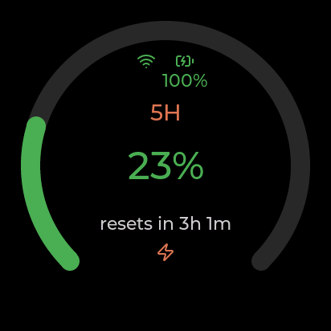
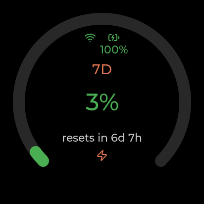
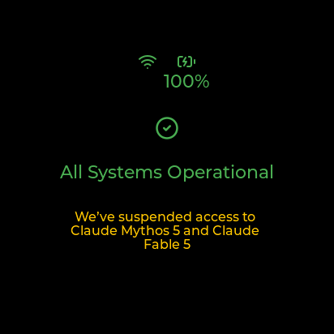
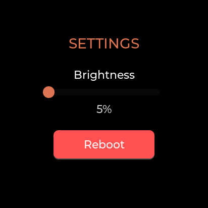

# Watcher Claude Usage Display

> An always-on desk display for your **Claude Code** usage limits — running standalone on a
> [SenseCAP Watcher](https://www.seeedstudio.com/SenseCAP-Watcher-W1-A-p-5979.html) (ESP32-S3).
> No host PC, no terminal: glance at the dial and see how much of your 5-hour and 7-day
> windows you've burned, when they reset, and whether Claude itself is having an incident.

<!-- TODO: replace with a hero photo or GIF of the real device on your desk -->
<p align="center">
  
  
  
</p>

---

## ✨ Features

- **Live 5h & 7d usage gauges** — utilization %, color-coded (green → amber → red), with a
  live countdown to each window's reset.
- **Claude service health** — pulls `status.claude.com` and surfaces active incidents (amber,
  never falsely green).
- **Five knob-navigated screens** — `5H` · `7D` · `SERVICE` · `CLAWD` (splash) · `SETTINGS`.
- **Spoken alerts** — the device *speaks* through its ES8311 speaker when usage rises past
  25/50/75/90/100 % or the battery falls past 50/30/20/10/5 % (muted while on USB power).
- **On-device WiFi provisioning** — captive phone portal; no hard-coded credentials required.
- **Secrets at rest** — the Claude OAuth token is stored AES-256-GCM encrypted in NVS.
- **Resilient polling** — configurable interval, stale-data indication, exponential 429 backoff.
- **Power UX** — persisted screen brightness, battery %, power-off / reboot from the menu.

## 📸 Screenshots

| 5-Hour | 7-Day | Service | Settings |
|--------|-------|---------|----------|
|  |  |  |  |

<!-- TODO: add a short demo GIF/video here -->

## 🧩 Hardware

Runs on the **[Seeed Studio SenseCAP Watcher](https://www.seeedstudio.com/SenseCAP-Watcher-W1-A-p-5979.html)**.

| Part | Detail |
|------|--------|
| MCU | ESP32-S3 @ 240 MHz, 8 MB octal PSRAM, 32 MB flash |
| Display | 1.45" round 412×412 SPD2010 LCD + touch (RGB565, byte-swapped) |
| Input | Rotary knob encoder (GPIO41/42) + push button |
| Audio | ES8311 codec — speaker + mic over I2S0 (used for spoken alerts) |
| Indicator | 1× WS2812 addressable RGB LED (GPIO40) |
| Connectivity | WiFi **2.4 GHz only** + BLE |
| Power | USB-C (rear = power, bottom = power + programming) + 3.7 V Li-ion |

> ⚠️ The ESP32-S3 is **2.4 GHz only** — a 5 GHz SSID will not connect.

## 🏗️ How it works

```
ESP32-S3  ──WiFi/HTTPS──>  api.anthropic.com  /v1/messages  (1-token probe)
                                  │
                          read rate-limit response headers
                                  │
   anthropic-ratelimit-unified-5h-utilization / -7d-utilization / -reset / -status
                                  │
                          state ──> LVGL UI (5 screens, knob nav)
                                  │
   status.claude.com/api/v2/summary.json ──> incident banner
```

The clever bit: Anthropic's dedicated `oauth/usage` endpoint needs a `user:profile` scope that a
`claude setup-token` token doesn't carry. So instead the firmware sends a **near-free 1-token
probe** to `POST /v1/messages` (cheap model, `max_tokens: 1`) and reads the
`anthropic-ratelimit-unified-*` **response headers** for the 5h/7d utilization, reset time, and
status. A correct `User-Agent: claude-code/<version>` is required or requests land in a heavy 429
bucket.

More detail lives in [`docs/specs/`](docs/specs/) — start with [`SPEC.md`](docs/specs/SPEC.md);
the full design and the append-only decision log (D1–D33) are in
[`02-DESIGN.md`](docs/specs/02-DESIGN.md) and [`03-API-REFERENCE.md`](docs/specs/03-API-REFERENCE.md).

## 💾 First flash on a NEW device — back up its identity FIRST

> **Do this once per physical device, before you ever flash custom firmware or run `erase-flash`.**
> Every SenseCAP Watcher ships with **unique, per-unit secrets** (`SN`, `EUI`/`BASICID`,
> `DEVICE_KEY`, `ACCESS_KEY`, `AES_KEY`, `DEV_CTL_KEY`) in its **`nvsfactory`** partition at
> **`0x9000`** (size `0x32000`, 200 KB). These are **NOT in any public factory image**, so once
> overwritten they are **gone forever**. Custom/example partition tables relabel `0x9000` as a
> generic `nvs`, so the app will format it on first boot. (Decision **D9**.)

Run these **read-only, non-destructive** commands first — activate the ESP-IDF environment and use
your device's flash UART (it was `COM18` here; baud `460800` is reliable on the CH342 bridge,
`921600` may corrupt):

```bash
# 1. Full 32 MB image — the gold-standard, bit-for-bit restore
esptool.py --chip esp32s3 -p COM18 -b 460800 read_flash 0x0 0x2000000 watcher_full_32MB.bin

# 2. Just the unique-credentials partition
esptool.py --chip esp32s3 -p COM18 -b 460800 read_flash 0x9000 0x32000 nvsfactory.bin

# 3. Record the eFuses (MAC, etc.)
espefuse.py --chip esp32s3 -p COM18 summary > efuse_summary.txt
```

**Store these OUTSIDE this repo — they contain live secrets; never commit them.** To restore a
device later:

```bash
esptool.py --chip esp32s3 -p COM18 -b 460800 write_flash 0x9000 nvsfactory.bin       # credentials only
esptool.py --chip esp32s3 -p COM18 -b 460800 write_flash 0x0   watcher_full_32MB.bin  # whole device
```

> 💡 Each device has its **own** identity — a backup from one unit will **not** restore another.
> Full rationale, the decoded partition map, and stock-firmware recovery live in
> [`docs/specs/04-HARDWARE-AND-FLASHING.md`](docs/specs/04-HARDWARE-AND-FLASHING.md) §6.

## 🔧 Build & flash

> ⚠️ **New device?** Complete the **device-identity backup** (section above) before flashing —
> it's irreversible once the app overwrites `0x9000`.

**Prerequisites**
- [ESP-IDF **v5.2.1**](https://docs.espressif.com/projects/esp-idf/en/v5.2.1/esp32s3/get-started/index.html) (target `esp32s3`)
- The Seeed BSP cloned **as a sibling folder** (the build's `override_path` expects it):

```bash
# Clone both repos next to each other:
git clone https://github.com/jeffrymahbuubi/watcher-claude-usage.git
git clone https://github.com/Seeed-Studio/SenseCAP-Watcher-Firmware.git
# Resulting layout:
#   <parent>/watcher-claude-usage/
#   <parent>/SenseCAP-Watcher-Firmware/        <-- BSP, referenced via override_path
```

**Configure your secrets** (these never get committed — `main/secrets.h` is git-ignored):

```bash
cd watcher-claude-usage/main
cp secrets.h.template secrets.h
#   edit secrets.h:
#   - WIFI_SSID / WIFI_PASSWORD   (2.4 GHz network)
#   - CLAUDE_OAUTH_TOKEN          (from:  claude setup-token)
#   - CLAUDE_CODE_VERSION         (from:  claude --version)
```
> You can also leave WiFi blank and use the on-device provisioning portal at first boot.

**Build & flash** (adjust the serial port):

```bash
idf.py set-target esp32s3
idf.py -p COM18 -b 460800 flash monitor
```

## ⚙️ Configuration

- **Poll interval** — configurable (default conservative 60–120 s).
- **Brightness** — adjustable from `SETTINGS` (press knob to edit), persisted across reboots.
- **Power** — power-off / reboot from the menu.

## 📁 Repository layout

```
watcher-claude-usage/
├── main/            ← firmware sources (UI, polling, provisioning, audio, secure store)
├── tools/           ← helper scripts: icon generation, audio-clip generation, screenshot grabber
├── docs/
│   ├── specs/       ← SPEC.md + 01–07 design docs + decision log (D1–D33)
│   └── screenshots/ ← captured UI screens
├── partitions.csv   ← custom partition table (keeps NVS at 0x9000)
├── sdkconfig.defaults
└── dependencies.lock
```

## 🙏 Credits & references

- [Seeed Studio SenseCAP Watcher](https://github.com/Seeed-Studio/SenseCAP-Watcher-Firmware) — hardware + open BSP
- [LVGL](https://lvgl.io/) — embedded UI framework
- [Clawdmeter](https://github.com/HermannBjorgvin/Clawdmeter) and [claude-usage-stick](https://github.com/oauramos/claude-usage-stick) — kindred projects that inspired a physical Claude-usage display

## 📄 License

[MIT](LICENSE) © 2026 Aunuun Jeffry Mahbuubi

---

*This firmware reads usage telemetry only — it never reports token counts or dollar amounts
(those aren't exposed by the available scope; see decision D3).*
